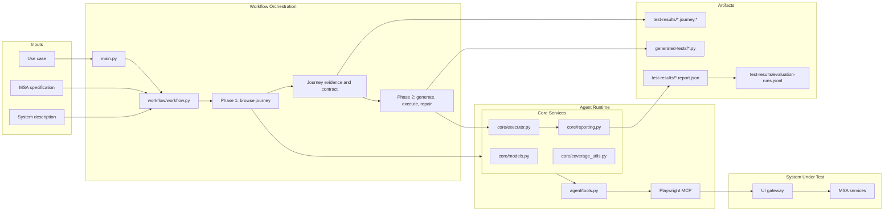

# Architecture Audit

This audit compares the current Python runtime with the intended two-phase
testing workflow.

## Runtime Flow

## Component Status

| Component | Status | Notes |
| --- | --- | --- |
| CLI | Implemented | `main.py` supports `run`, `test`, repeated runs, use-case IDs, use-case files, and runtime paths. |
| Workflow orchestration | Implemented | `workflow/workflow.py` controls browsing, journey capture, generation, execution, repair, and reporting. |
| Structured use cases | Implemented | Loaded from `spec/use_cases/index.yaml` and the referenced YAML files. |
| MSA specification | Implemented | `spec/msa.yaml` is loaded, sliced for prompts, and parsed for coverage mapping. |
| System description | Implemented | Loaded from `spec/system_description.md` when supplied or defaulted. |
| Browser interaction | Implemented | Uses Playwright MCP through the Pydantic AI agent runtime. |
| Journey guide | Implemented | Saved as Markdown and JSON before test generation. |
| Journey contract | Implemented | Built from captured actions, interaction contracts, observed calls, baseline observations, and success observations. |
| Test generation | Implemented | Produces one `pytest-playwright` file per run. |
| Test execution | Implemented | Runs pytest through `core/executor.py`. |
| Repair loop | Implemented | Bounded by the configured retry budget. |
| Reporting | Implemented | Writes report JSON, evaluation history, summary tables, screenshots, and network artifacts. |
| Backend tracing | Not implemented | Current evidence is limited to frontend-visible HTTP requests. |

## Known Gaps

1. Generated output is one candidate test per run, not an assembled suite.
2. Backend coverage is based on gateway-visible HTTP traffic, not distributed tracing.
3. The same model-backed runtime handles browse and generation phases.
4. External report formats such as JUnit XML are not part of the current reporting path.
5. Main-study state reset is not enforced by the Python workflow.

## Scope

The implemented architecture supports the current research workflow: use a
structured task, browse the live system, save journey evidence, generate a
test, execute it, repair it, and report the result. It does not provide full
backend coverage or complete automated suite construction.
