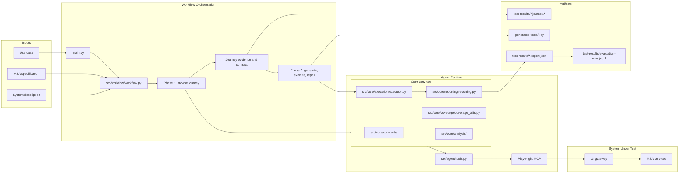

# Architecture Status

This document describes the implemented Python runtime and how it supports the
two-phase MAESTRO workflow.

## Runtime Flow

## Component Status

| Component | Status | Notes |
| --- | --- | --- |
| CLI | Implemented | `main.py` supports ad-hoc browser tasks, generated-test runs, repeated experiments, use-case IDs, use-case files, and runtime path overrides. |
| Workflow orchestration | Implemented | `src/workflow/workflow.py` controls browsing, journey capture, generation, execution, repair, and reporting. |
| Structured use cases | Implemented | Loaded from `spec/use_cases/index.yaml` and the referenced YAML files. |
| MSA specification | Implemented | `spec/msa.yaml` is loaded, sliced for prompt context, and parsed for coverage mapping. |
| System description | Implemented | Loaded from `spec/system_description.md` or from a user-supplied path. |
| Browser interaction | Implemented | Uses Playwright MCP through the Pydantic AI agent runtime. |
| Journey guide | Implemented | Saved as Markdown and JSON before test generation. |
| Journey contract | Implemented | Built from captured actions, interaction contracts, observed calls, baseline observations, and success observations. |
| Test generation | Implemented | Produces one `pytest-playwright` file per run. |
| Test execution | Implemented | Runs pytest through `src/core/execution/executor.py`. |
| Repair loop | Implemented | Bounded by the configured retry budget. |
| Reporting | Implemented | Writes report JSON, evaluation history, summary tables, screenshots, and network artifacts. |
| Backend tracing | Not implemented | Current evidence is limited to browser-visible HTTP requests. |

## Current Limits

1. Generated output is one candidate test per run, not an assembled suite.
2. Backend coverage is based on browser-visible HTTP traffic, not distributed tracing.
3. A single model-backed agent is reused across the browse and generation phases.
4. External report formats, such as JUnit XML, are not part of the current reporting path.
5. Main-study state reset is not enforced by the Python workflow.

## Scope

The architecture supports the current research workflow: take a structured task,
browse the live system, save journey evidence, generate a test, execute it,
repair it when needed, and report the result. It does not claim full backend
coverage or automated construction of a complete regression suite.
