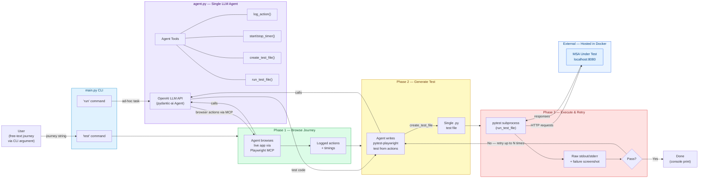

# Current Code Flow (as implemented)

> How the root-level Python runtime actually works today.

## Key Differences from the Target Architecture

| Target Architecture | Current Code |
|---|---|
| **User Journey Extractor** takes use-case + MSA-spec documents and calls LLM to produce journeys | Journey is a **raw CLI string** typed by the user |
| **GUI description** document is fed into the Test Suite Generator | Agent **discovers the GUI live** by browsing via Playwright MCP |
| Generator and Executor are **separate components** | Both live inside **one monolithic agent** with a retry loop |
| A structured **Test Report** is produced and fed back | Only **raw console output** + optional failure screenshots |
