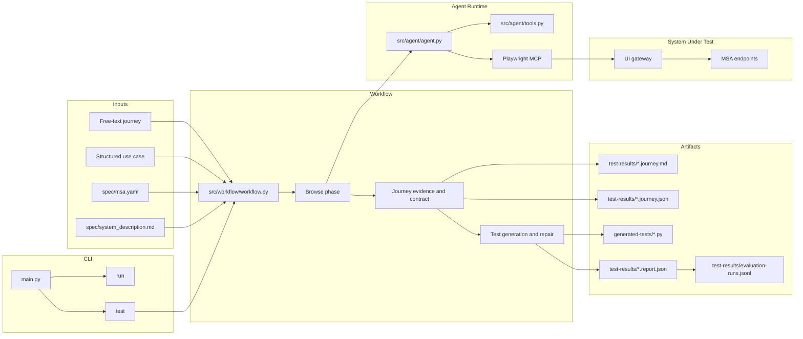

# Current Code Flow

This document summarizes the Python runtime after the `src/` layout and `core/`
subpackage split.

## Run Sequence

1. `main.py` parses the CLI arguments and calls the workflow layer.
2. `src/workflow/workflow.py` loads the selected use case, MSA specification, and system description.
3. The browse phase drives the deployed UI through Playwright MCP.
4. Agent tools record actions, timings, API calls, interaction contracts, baseline observations, and success observations.
5. The workflow builds and saves the journey guide before generating code.
6. The generation phase writes a `pytest-playwright` file to `generated-tests/`.
7. The generated test runs through the pytest subprocess runner.
8. Reports and evaluation history are written under `test-results/`.

## Runtime Boundaries

| Area | Current behavior |
| --- | --- |
| Use-case input | Free-text journey, use-case ID, or use-case file |
| GUI model | Discovered through live browsing, not loaded from a static GUI description |
| Test output | One generated Python test file per run |
| Execution | pytest subprocess through `src/core/execution/executor.py` |
| Reporting | Journey Markdown/JSON, report JSON, network data, evaluation history |
| Backend evidence | Browser-visible HTTP requests matched to `spec/msa.yaml` |
