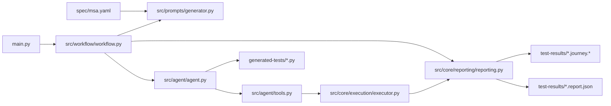

# Python Runtime Baseline

This document records the root-level Python runtime after the package
restructure.

## Scope

- Runtime entry point: `main.py`
- Runtime packages: `src/agent/`, `src/workflow/`, `src/prompts/`, `src/core/`
- Local specifications: `spec/`
- Generated artifacts: `generated-tests/`, `test-results/`, `runtime-results/`

The legacy Java prototype and the old wrapper `python/` directory are not part
of this runtime.

## Runtime Flow



## Package Responsibilities

| Path | Responsibility |
| --- | --- |
| `main.py` | CLI parsing and command dispatch. |
| `src/workflow/` | End-to-end orchestration for browsing, generation, execution, repair, and reporting. |
| `src/prompts/` | Spec loading, use-case loading, prompt construction, filename derivation, and prompt rendering. |
| `src/agent/agent.py` | Pydantic AI agent construction and Playwright MCP setup. |
| `src/agent/tools.py` | Tool functions for logging, timers, spec reading, test creation, test execution, and journey outcome reporting. |
| `src/core/contracts/` | Typed data models and journey-contract construction. |
| `src/core/execution/` | pytest subprocess runner, retry budgets, artifact paths, and runtime environment defaults. |
| `src/core/reporting/` | Journey-guide construction, execution-report construction, console rendering, and Markdown rendering. |
| `src/core/evaluation/` | Evaluation-history append, summary regeneration, and run-level metric aggregation. |
| `src/core/analysis/` | Failure-kind, blocked-run, mutation, GUI-count, sequence, and false-positive heuristics. |
| `src/core/coverage/` | MSA operation matching and service-operation coverage mapping. |
| `src/core/capture/` | Prompt and run-input capture helpers. |

## Test Command Flow

For:

```bash
uv run python main.py test "<journey>" --filename test_foo.py --max-retries 5
```

the runtime follows these steps:

1. `main.py` parses arguments and calls `workflow.generate_test(...)`.
2. `src/prompts/generator.py` loads the MSA specification and system description.
3. The browse prompt is sent to the agent runtime.
4. Playwright MCP drives the deployed UI.
5. Agent tools record actions, timings, API calls, interaction contracts, baseline observations, and success observations.
6. `src/core/reporting/reporting.py` builds the journey guide and journey contract.
7. The journey guide is saved before test generation.
8. The generation prompt includes the replay plan and structured contract.
9. The generated test is saved under `generated-tests/`.
10. The generated test runs through `src/core/execution/executor.py`.
11. The execution report is saved under `test-results/`.
12. Evaluation history is appended and the summary table is refreshed.

## Persisted Artifacts

| Artifact | Purpose |
| --- | --- |
| `generated-tests/<name>.py` | Generated pytest-playwright test. |
| `test-results/<name>.journey.md` | Human-readable browse journey and contract summary. |
| `test-results/<name>.journey.json` | Machine-readable journey evidence and coverage data. |
| `test-results/<name>.report.json` | Final execution report. |
| `test-results/<name>.network.json` | Browser-visible API requests captured during pytest execution. |
| `test-results/evaluation-runs.jsonl` | Append-only run history. |
| `test-results/evaluation-summary.md` | Aggregated evaluation tables. |
| `runtime-results/` | pytest-playwright screenshots and runtime artifacts. |

## Core Data Contracts

| Model | Contents |
| --- | --- |
| `ActionStep` | One logged interaction and its note. |
| `TimingSample` | Elapsed time for a named step. |
| `JourneyCapture` | Browse actions, timings, API calls, interaction contracts, and observations. |
| `JourneyContract` | Actions, expected service calls, baseline observations, success observations, completeness state, and issues. |
| `CoverageSnapshot` | UI-step counts, endpoint candidates, service candidates, and operation coverage data. |
| `JourneyGuide` | Requested journey, capture clone, coverage snapshot, contract, and saved paths. |
| `ExecutionResult` | pytest subprocess output and collected runtime artifacts. |
| `ExecutionReport` | Final status, summary, raw output, coverage, phase metrics, and artifact paths. |
| `Phase1Metrics` | Generation, syntax, retries, hash, GUI, API, and failure-classification metrics. |

## Coverage Model

The coverage model is intentionally conservative:

- UI coverage is derived from logged browser actions and timers.
- Endpoint candidates are inferred from journey text and logged actions matched against `spec/msa.yaml`.
- Operation coverage during replay is based on browser-visible `/api/` requests captured by Playwright.
- Service coverage means matched gateway-level operations, not internal service-to-service tracing.
- DOM-node coverage is not implemented.

## Current Limits

1. Backend evidence is limited to browser-visible HTTP traffic.
2. External report formats such as JUnit XML are not generated.
3. The browse and generation phases reuse the same agent runtime.
4. The workflow does not enforce full system state reset between repeated runs.
5. DOM-node coverage and distributed tracing are outside the current implementation.
