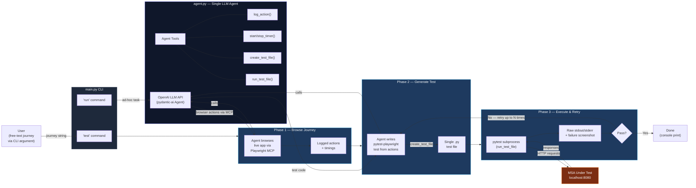

# Architecture Compliance Audit — `python/` Directory

> Compared against the Testing Framework architecture diagram (March 2026)

---

## Architecture Diagram Summary

The diagram defines a **Testing Framework** with four distinct components and clear data flows:

| # | Component | Inputs | LLM Interaction | Outputs |
|---|-----------|--------|-----------------|---------|
| 1 | **User Journey Extractor** | Use cases + MSA specification | Prompt → LLM → candidate journeys | User journeys |
| 2 | **Test Suite Generator** | User journeys + GUI description | Prompt → LLM → UI E2E test suite | Executable test suite |
| 3 | **Test Executor** | Executable test suite | _(none)_ | Test report |
| 4 | **MSA Under Test** | Requests from Test Executor | _(none)_ | Responses back to Test Executor |

---

## Current Code Flow (as implemented)

**Key differences from the target architecture:**

- There is **no User Journey Extractor** — the journey arrives as a raw CLI string, not extracted from documents via LLM.
- There is **no GUI description** input — the agent discovers the GUI by browsing the live app.
- Generator and Executor are **not separate components** — they live inside one monolithic agent with a retry loop.
- There is **no structured Test Report** — only raw console output and optional failure screenshots.

---

## Component-by-Component Audit

### 1. User Journey Extractor — [MISSING] MISSING

| Aspect | Status |
|--------|--------|
| Dedicated module / class | [MISSING] Does not exist |
| Accepts use-case documents as input | [MISSING] Not implemented |
| Accepts MSA specification as input | [MISSING] Not implemented |
| Sends structured prompt to LLM | [MISSING] Not implemented |
| Outputs structured user journeys | [MISSING] Not implemented |

**What exists instead:** The user journey is supplied as a **free-text CLI argument** (`main.py test <journey>`). There is no automated extraction from use-case or MSA specification documents.

---

### 2. Test Suite Generator — [PARTIAL] PARTIALLY PRESENT

| Aspect | Status |
|--------|--------|
| Receives user journeys | [OK] `main.py generate_test()` receives the journey string |
| Receives GUI description | [MISSING] No GUI description input; the agent browses the live app instead |
| Calls LLM to generate tests | [OK] Two-phase `agent.run()` calls in `generate_test()` use the LLM |
| Outputs executable test suite | [PARTIAL] Outputs a **single test file**, not a full suite |

**Details:**
- `generate_test()` in `main.py` first runs the journey in a live browser (phase 1), then asks the LLM to write a pytest-playwright test from the logged actions (phase 2).
- The diagram expects a **GUI description document** as a separate input; the code replaces this with live browser interaction (Playwright MCP).
- Output is a single `.py` test file, not a structured test suite.

---

### 3. Test Executor — [PARTIAL] PARTIALLY PRESENT

| Aspect | Status |
|--------|--------|
| Runs the executable test suite | [OK] `run_test_file()` tool in `agent.py` executes pytest |
| Runs against the MSA Under Test | [OK] Tests target `BASE_URL` (localhost:8080) |
| Produces a test report | [PARTIAL] Returns raw stdout/stderr; no structured test report artifact is generated |
| Feeds report back into the framework | [MISSING] Report is printed to console, not persisted or fed back |

**Details:**
- `run_test_file()` runs `pytest` via subprocess and captures output + failure screenshots.
- There is no structured **Test Report** artifact (e.g., HTML, JUnit XML, JSON) as shown in the diagram.
- The retry loop in `generate_test()` does feed failures back to the LLM for fixing, which is a form of feedback but not the formal report loop shown in the diagram.

---

### 4. MSA Under Test — [OK] EXTERNAL (Out of Scope)

The MSA Under Test is an external service (configured via `BASE_URL=http://localhost:8080`). This is correctly treated as external to the framework.

---

## Summary Table

| Diagram Component | Code Status | Key Gap |
|---|---|---|
| **User Journey Extractor** | [MISSING] Missing | No module to extract journeys from use-case/MSA-spec documents via LLM |
| **Test Suite Generator** | [PARTIAL] Partial | No GUI description input; generates single file, not full suite |
| **Test Executor** | [PARTIAL] Partial | No structured test report output; no formal feedback loop |
| **MSA Under Test** | [OK] External | Correctly external (localhost:8080) |
| **LLM API integration** | [OK] Present | Connected via `pydantic-ai` Agent using OpenAI |
| **Testing Framework boundary** | [PARTIAL] Implicit | No explicit framework abstraction; components are not separated into distinct modules |

---

## Additional Observations

1. **Duplicate tool definition:** `create_test_file` is defined twice in `agent.py` (lines 75–82 for Java, lines 84–91 for Python). The second definition silently overwrites the first. Only one can be active at runtime.

2. **No separation of concerns:** The diagram shows distinct components (Extractor → Generator → Executor). The code merges Generator and Executor logic into a single `generate_test()` function in `main.py`, with tools in `agent.py`.

3. **No input document handling:** The diagram shows "Use cases + MSA specification" as document inputs (file icons). The code has no file-reading or document-parsing capability.

4. **No GUI description input:** The diagram shows a "GUI description" document fed into the Test Suite Generator. The code does not accept or use any such document.

5. **`.env` configuration:** Contains references to Selenium, Maven, and Docker that are unused by the Python codebase — likely leftover from a Java-based variant.
