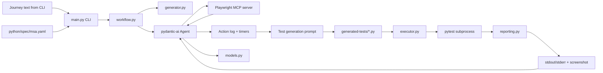
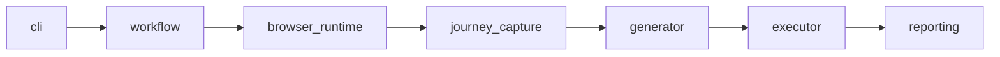

# Python Architecture Baseline

This document defines the current and target architecture for the Python runtime only.
It also tracks the first refactor slices that have already been implemented.

Scope:
- In scope: `python/main.py`, `python/agent.py`, generated pytest files, and local test execution.
- In scope: the default MSA specification at `python/spec/msa.yaml`.
- Out of scope: everything under `java/`.

## Current System

Today the Python path is still an agent-centered workflow, but the code is no longer packed into only two files.



The implementation is currently split across seven files:
- `python/main.py`
  - CLI parsing
  - command dispatch only
- `python/workflow.py`
  - `run` orchestration
  - `test` orchestration
- `python/generator.py`
  - MSA spec loading
  - browse prompt construction
  - test-generation prompt construction
- `python/agent.py`
  - pydantic-ai agent construction
  - Playwright MCP stdio server setup
  - action logging tool
  - timing tools
  - test file creation tools
  - thin executor adapter tool
- `python/executor.py`
  - pytest subprocess execution
  - failure artifact discovery
- `python/reporting.py`
  - execution report normalization
  - console text rendering from execution results
- `python/models.py`
  - typed capture and execution models

## What The Current Code Actually Does

For `uv run python main.py test "<journey>"`:

1. `main.py` dispatches to `workflow.py`.
2. `workflow.py` creates a `Deps` object and loads `python/spec/msa.yaml`.
3. `generator.py` builds the browse prompt using the journey text and MSA spec.
4. The agent receives that browse prompt and controls the browser through Playwright MCP.
5. The model calls `log_action`, `start_timer`, and `stop_timer` while exploring.
6. `models.py` stores the captured actions and timings as typed data.
7. `generator.py` builds the test-generation prompt from the typed capture plus the MSA spec.
8. The model writes a file under `generated-tests/` through an agent tool.
9. The model runs the generated test through another agent tool.
10. `executor.py` runs pytest and collects the latest failure screenshot when present.
11. `reporting.py` converts execution results into a stable report before the agent sees them.

For `uv run python main.py run "<task>"`:

1. `main.py` optionally navigates to a starting URL.
2. The same agent handles the task directly with browser MCP tools.

## Current Problems

The current Python runtime works as a prototype, but the architecture is weak in a few specific ways.

1. The `test` flow still relies on one LLM-driven runtime rather than separate generator and executor services.
2. Reporting is now structured in memory, but there is still no persisted JSON or JUnit report artifact.
3. The MSA spec is still injected into prompts as raw text, not as a structured domain model.

## Target Python Architecture

The target is still one Python application, but with explicit module boundaries.



### Target Responsibilities

`cli`
- Parse args.
- Call the correct workflow entrypoint.
- Print final summaries.

`workflow`
- Own the end-to-end `run` and `test` flows.
- Coordinate phase order.
- Pass structured models between phases.

`browser_runtime`
- Build and own the pydantic-ai agent.
- Register MCP servers and agent tools.
- Expose a small interface for "browse journey" and "run ad hoc task".

`journey_capture`
- Store actions and timings in structured models.
- Format action history when needed for prompts.

`generator`
- Build the prompt for test generation.
- Validate output filename conventions.
- Return a structured generated test object.

`executor`
- Run pytest.
- Collect stdout, stderr, exit code, screenshots, and output paths.
- Avoid any LLM-specific logic.

`reporting`
- Convert executor output into a stable report model.
- Provide text summaries for console output.
- Later support JSON or JUnit-style artifacts if needed.

## Recommended Module Layout

This is the module layout now in place:

```text
python/
  main.py
  agent.py
  models.py
  workflow.py
  generator.py
  executor.py
  reporting.py
```

Current ownership:
- `main.py`: CLI only
- `agent.py`: agent setup and agent tools only
- `models.py`: dataclasses / typed results shared across the runtime
- `workflow.py`: orchestration for `run` and `test`
- `generator.py`: prompt assembly and MSA spec loading
- `executor.py`: pytest subprocess execution
- `reporting.py`: execution report normalization and console rendering

## Data Contracts To Introduce First

These contracts let the refactor happen without changing the CLI surface.

```python
ActionStep
- action: str
- note: str

TimingSample
- name: str
- elapsed_seconds: float

JourneyCapture
- actions: list[ActionStep]
- timings: list[TimingSample]

GeneratedTest
- filename: str
- code: str
- source_actions: list[ActionStep]

ExecutionArtifact
- kind: str  # screenshot, log, report
- path: str

ExecutionResult
- filename: str
- exit_code: int
- stdout: str
- stderr: str
- artifacts: list[ExecutionArtifact]

ExecutionReport
- filename: str
- status: str
- exit_code: int
- summary: str
- details: str
- artifacts: list[ExecutionArtifact]
```

## Migration Plan

### Phase 1: Stabilize The Existing Flow

- Keep the current CLI exactly as it is.
- Keep `python/spec/msa.yaml` as the default local MSA context for `test`.
- Keep the current two-pass browse -> generate/run behavior.
Status: implemented

### Phase 2: Extract Shared Models

- Add `models.py`.
- Replace raw `dict` action log entries with typed models.
- Move action-summary formatting out of `main.py`.
Status: implemented

### Phase 3: Extract Executor And Reporting

- Move pytest subprocess code out of `agent.py` into `executor.py`.
- Make execution return `ExecutionResult` instead of raw strings.
- Keep the agent tool as a thin adapter around the executor.
Status: implemented

### Phase 4: Extract Workflow Logic

- Move `generate_test()` and `run` flow logic out of `main.py` into `workflow.py`.
- Make `main.py` only parse args and call workflow functions.
Status: implemented

### Phase 5: Extract Generator Responsibilities

- Move prompt construction and filename validation into `generator.py`.
- Keep the agent as the runtime and tool host, not the owner of prompt assembly.
Status: implemented for prompt construction and MSA-spec loading

### Phase 6: Optional Future Extractor

If you later want the bigger framework:
- add a document-driven journey extractor as a separate module
- keep `python/spec/msa.yaml` as default domain context even if richer inputs are added
- add GUI description input
- add durable report artifacts

That is a future extension, not part of the current Python baseline.

## Rules For The Refactor

1. Do not break `uv run python main.py run ...`.
2. Do not break `uv run python main.py test ...`.
3. Keep Playwright MCP behind one module boundary.
4. Keep subprocess pytest execution outside of prompt-building logic.
5. Prefer typed models over passing prompt strings between modules.
6. Keep generated tests under `generated-tests/`.

## Immediate Next Step

The next implementation step should be:

1. Persist the execution report as JSON or JUnit-style output under `test-results/`.
2. Decide whether the MSA spec should stay as raw prompt context or be normalized into structured guidance before prompting.
3. Consider splitting browser exploration and test synthesis into separately invokable workflow stages.

Those steps will finish the first modularization pass without changing the user-facing CLI.
