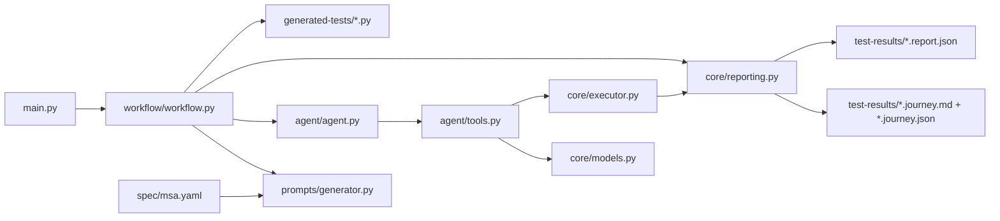

# Python Architecture Baseline

This document captures the current Python-only runtime after the package split.
It reflects the actual flow that runs today, including the saved journey guide
that is produced before test generation and the first-pass coverage snapshot
that is persisted for later evaluation.

Scope:
- In scope: everything under `python/`
- In scope: `python/spec/msa.yaml` as the local MSA context
- Out of scope: everything under `java/`

## Current Runtime

## Package Responsibilities

- `main.py`
  - CLI parsing
  - command dispatch only
- `workflow/`
  - owns the `run` and `test` orchestration
  - keeps `main.py` unchanged via `workflow/__init__.py`
- `prompts/`
  - loads `spec/msa.yaml`
  - builds browse and test-generation prompts
  - validates generated test filenames
- `agent/`
  - constructs the PydanticAI agent and Playwright MCP server
  - registers all `@agent.tool` functions
- `core/models.py`
  - typed journey, coverage, execution, and reporting models
- `core/executor.py`
  - runs pytest in a subprocess
  - collects stdout, stderr, exit code, and artifacts
- `core/reporting.py`
  - builds journey guides before code generation
  - builds execution reports after test execution
  - persists markdown and JSON artifacts under `test-results/`

## Current Test Flow

For `uv run python main.py test "<journey>" --filename test_foo.py --max-retries 5`:

1. `main.py` dispatches to `workflow.generate_test(...)`.
2. `prompts/generator.py` loads `spec/msa.yaml`.
3. The agent browses the live UI with Playwright MCP.
4. The browse phase logs actions and timings through `agent/tools.py`.
5. `core/reporting.py` converts that capture into a saved journey guide before any test file is generated.
6. The journey guide is written to:
   - `test-results/<test_name>.journey.md`
   - `test-results/<test_name>.journey.json`
7. The test-generation prompt uses the requested journey, the MSA spec, and the captured browse steps.
8. The agent writes `generated-tests/<test_name>.py`.
9. The agent runs the generated test through `core/executor.py`.
10. `core/reporting.py` writes `test-results/<test_name>.report.json`.
11. The execution report includes the saved journey artifacts plus a first-pass coverage snapshot.

## Persisted Artifacts

For each generated test name `test_foo.py`, the runtime now persists:

- `generated-tests/test_foo.py`
  - generated Playwright pytest file
- `test-results/test_foo.journey.md`
  - human-readable UI journey guide
- `test-results/test_foo.journey.json`
  - machine-readable journey and coverage data
- `test-results/test_foo.report.json`
  - execution result plus artifact references

## Typed Contracts In Use

The current Python flow already uses these core contracts:

- `ActionStep`
  - one logged UI action and why it was taken
- `TimingSample`
  - elapsed time for a named step
- `JourneyCapture`
  - ordered browse-phase actions and timings
- `CoverageSnapshot`
  - UI-step count
  - unique-action count
  - timed-step count
  - endpoint candidate count
  - service candidate count
  - candidate endpoint and service labels
  - caveat notes about heuristic coverage
- `JourneyGuide`
  - requested journey
  - cloned `JourneyCapture`
  - persisted paths for markdown and JSON guide artifacts
  - `CoverageSnapshot`
- `ExecutionResult`
  - subprocess result and collected artifacts
- `ExecutionReport`
  - pass/fail status
  - summary and raw output
  - saved report path
  - related artifacts
  - optional `CoverageSnapshot`

## Coverage Model Today

Coverage is intentionally conservative at this stage.

- UI coverage is based on logged browser actions and timers.
- Endpoint coverage is heuristic: journey text plus logged actions are matched against endpoints declared in `spec/msa.yaml`.
- Service coverage is derived from the matched endpoint set and acts as a first-pass node or microservice coverage estimate.
- DOM-node coverage is not implemented yet.

This is enough to support later evaluation work without pretending that true backend or UI instrumentation already exists.

## Current Gaps

The architecture is cleaner than before, but a few gaps remain:

1. Coverage is still heuristic and spec-driven, not instrumented from network traffic or DOM traversal.
2. Reporting is persisted as JSON and markdown, but not yet as JUnit or another external test-report format.
3. The workflow still relies on one agent runtime across browse, synthesize, and execute phases.

## Near-Term Direction

The next reasonable additions are:

1. Capture actual request or route usage from the browser to replace heuristic endpoint matching.
2. Add explicit UI-node coverage if later evaluation needs DOM-level evidence instead of action logs.
3. Persist a portable test report format alongside the existing JSON artifacts.
4. Optionally split browse and synthesize into separately invokable workflow stages.
